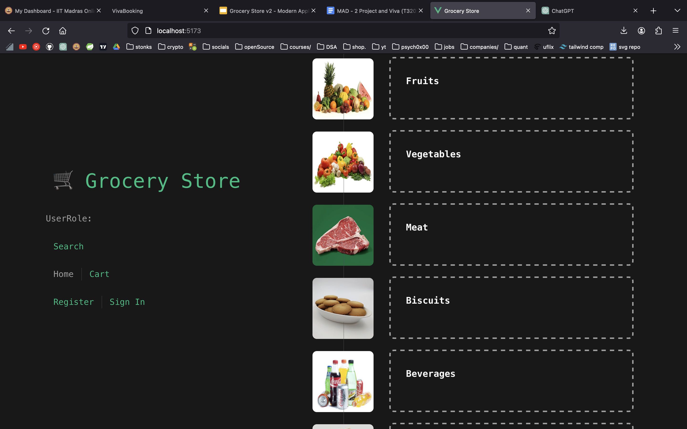
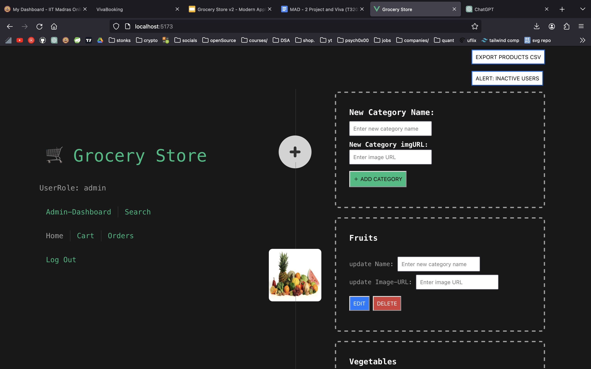
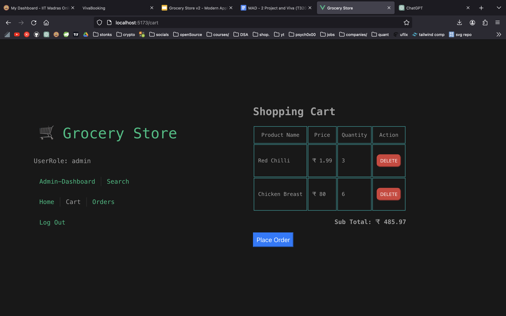
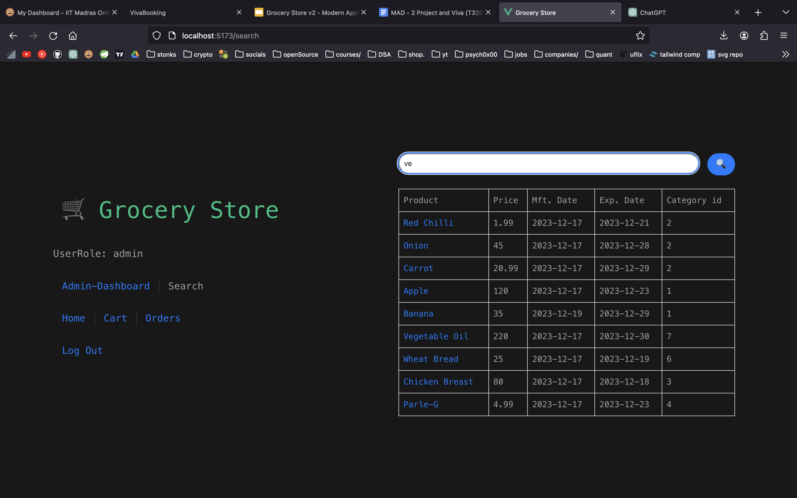

# Grocery

**Fullstack-Flask-Vue-Redis-Celery-Project**

## How to Run

- Clone the repository.
  
  ```shell
  git clone https://github.com/anurag-sachan/Flask-Vue-Redis-Celery-FullstackStore.git
  ```

- Spin the docker container for redis-instance and update the backend configurations [**here**](app.py).
  
    > If you are unsure about the redis setup, you can always use docker. It's extremely simple. <br/>
    > Go to base folder. Run the command below :

    > This will create a redis container named `my-redis-container`

    ```shell
    docker run --rm --name my-redis-container -p 6379:6379 -d redis
    ```

    > To check if the instance is running properly
    > redis-cli ping
    > redis-cli -d 0
    > keys *

- Setup the Celery workers ( for tasks ) & beat ( for schedule jobs )
  ```shell
  celery -A app.celery_app worker --loglevel=info
  ```

  ```shell
  celery -A app.celery_app beat --loglevel=info
  ```
    
- Run the Backend:
  > If database.db is not present

  ```shell
  python3 DB.py
  ```
  ```shell
  python3 app.py
  ```
  
  > If database.db is already present
  ```shell
  python3 app.py
  ```

- Run the frontend:

  cd frontend/

  ```shell
  # to install required node_module files

  npm install
  ```

  ```shell
  npm run dev
  ```

## Screenshots
- Please refer to the working demo-images from [**here**](demo-jpg).
  
User                  |  Admin
:-------------------------:|:-------------------------:
  |  
  |  
  |  
  |  

<br/>
Thanks,

Anurag.


# 技术栈


- 前端：Vue 3 + Vite + Vue Router + Axios
- 后端：Flask（含 Flask-JWT-Extended、Flask-Caching、Flask-Mail、Flask-CORS）
- 任务队列：Celery（基于 Redis 作为 broker 和 backend）
- 数据库：MySQl
- 其他：Redis（缓存和 Celery 消息队列）

主要功能模块：
- 用户注册、登录、角色管理（用户/管理员/经理）
- 商品、分类、购物车、订单管理
- 搜索、导出报表（CSV/邮件）、定时任务
- 前后端分离，接口通过 Axios 调用


# 数据库

简单的电商平台数据库结构

|表名|功能用途简述|
|---|---|
|`users`|存储用户信息（包含角色）|
|`products`|商品信息表|
|`categories`|商品分类表|
|`kart`|购物车（某用户添加的商品）|
|`orders`|订单记录表|
|`requests`|商品变更请求（如新增或修改申请）|
![[ChatGPT_Image_May_31,_2025,_09_32_09_PM.png]]


users表

|字段名|类型|含义|
|---|---|---|
|`userId`|INTEGER|主键，自增，用户唯一标识|
|`password`|TEXT|用户密码（明文，建议加密）|
|`email`|TEXT|用户邮箱，唯一|
|`firstName`|TEXT|名字|
|`lastName`|TEXT|姓氏|
|`role`|TEXT|角色，如 `admin` 或 `user`|

products表

|字段名|类型|含义|
|---|---|---|
|`productId`|INTEGER|主键，自增|
|`name`|TEXT|商品名称|
|`price`|REAL|单价|
|`image`|TEXT|图片链接（或路径）|
|`mft`|DATE|生产日期|
|`exp`|DATE|过期日期|
|`stock`|INTEGER|库存|
|`categoryId`|INTEGER|商品分类（外键）|
|`unit`|TEXT|单位（如盒、瓶、公斤等）|

categories表

|字段名|类型|含义|
|---|---|---|
|`categoryId`|INTEGER|主键|
|`name`|TEXT|分类名，唯一|
|`image`|TEXT|分类图标或封面图|

cart表

|字段名|类型|含义|
|---|---|---|
|`cartId`|INTEGER|主键，自增|
|`userId`|INTEGER|外键，对应 `users` 表|
|`productId`|INTEGER|外键，对应 `products` 表|
|`name`|TEXT|商品名称（冗余存储）|
|`price`|REAL|单价|
|`quantity`|INTEGER|数量|

orders表

|字段名|类型|含义|
|---|---|---|
|`orderId`|INTEGER|主键，自增|
|`userId`|INTEGER|下单用户 ID|
|`name`|TEXT|商品名（冗余）|
|`price`|REAL|单价|
|`quantity`|INTEGER|购买数量|
|`date`|DATE|下单时间|
|`productId`|INTEGER|商品 ID|

requests表

| 字段名           | 类型      | 含义             |
| ------------- | ------- | -------------- |
| `requestId`   | INTEGER | 主键，自增          |
| `requestType` | TEXT    | 请求类型（如新增、新价格等） |
| `categoryId`  | INTEGER | 所属分类           |
| `productId`   | INTEGER | 原商品 ID（若是修改的话） |
| `oldName`     | TEXT    | 原商品名（若是修改）     |
| `name`        | TEXT    | 新商品名           |
| `price`       | REAL    | 新价格            |
| `image`       | TEXT    | 新图片            |
| `mft`         | DATE    | 新生产日期          |
| `exp`         | DATE    | 新过期日期          |
| `stock`       | INTEGER | 新库存            |
| `unit`        | TEXT    | 单位             |
| `userName`    | TEXT    | 提出请求的用户名称（冗余）  |
| `userId`      | INTEGER | 外键，对应提出请求的用户   |


# Backend

## 技术栈

- Flask：Web 框架，负责路由、请求处理、Session 管理等。
- Flask-JWT-Extended：JWT 认证，接口安全。
- Flask-Caching：缓存，提升性能。
- Flask-Mail：邮件发送。
- Flask-CORS：跨域资源共享，支持前后端分离。
- Celery：异步任务队列，配合 Redis 实现任务分发、定时任务。
- SQLite：轻量级数据库。
- Redis：消息队列和缓存。


## 主要功能模块

 （1）异步任务与定时任务
- generate_products_csv：生成商品报表（CSV），异步任务。
- alertInactiveUsers：定时给未下单用户发邮件提醒。
- export_orders：导出用户订单并邮件发送。
- setup_periodic_tasks：Celery Beat 定时调度任务。

 （2）用户与权限
- 注册、登录、登出（JWT 认证，Session 管理）。
- 用户角色（user/manager/admin），部分接口需校验角色。
- 用户增删改查、角色变更。

 （3）商品、分类、购物车、订单
- 商品、分类的增删改查。
- 购物车管理（增、删、清空）。
- 下单、订单管理。
- 搜索商品。

 （4）请求与审批流
- 管理员/经理的操作需审批（如商品/分类的增删改），通过 requests 表实现。

 （5）接口设计
- RESTful 风格，前后端分离，返回 JSON。
- 部分接口支持 GET/POST，部分接口需 JWT 认证。


## 知识总结

1. Flask 基础：路由、请求处理、Session、JSON 响应。
2. JWT 认证：接口安全、用户身份校验。
3. Celery 异步任务：任务分发、定时任务、任务状态查询。
4. 数据库操作：SQLite，参数化查询，事务管理。
5. 缓存：Flask-Caching + Redis，接口缓存。
6. 邮件服务：Flask-Mail，邮件模板、异常处理。
7. 权限与角色管理：多角色系统，接口权限控制。
8. RESTful API 设计：资源路径、请求方法、参数传递。
9. 前后端分离与 CORS：支持跨域请求。
10. 异常处理与事务回滚：try/except、数据库回滚。
11. 审批流设计：通过 requests 表实现操作审批。
12. 代码结构与可维护性：函数划分、注释、可扩展性。


# Foreend

## 技术栈

- Vue 3：主流渐进式前端框架，支持组合式 API。
- Vite：新一代前端构建工具，极快的冷启动和热更新体验。
- Vue Router：前端路由管理。
- Axios：HTTP 请求库，前后端数据交互。
- CSS：自定义样式，部分组件使用 scoped CSS。
- Node.js/NPM：依赖管理与脚本运行。


## 主要功能模块

- 用户注册/登录/权限管理：与后端接口对接，支持多角色。
- 商品、分类、购物车、订单管理：页面和组件分离，数据驱动视图。
- 搜索、筛选、报表导出：支持商品搜索、数据导出等功能。
- 响应式布局：适配不同屏幕，部分组件有媒体查询。
- 接口请求：统一用 Axios 调用后端 API，数据双向绑定。


## 知识总结

1. Vue 3 组合式 API：如 setup、ref、reactive、生命周期钩子。
2. 组件化开发：页面（views）与复用组件（components）分离，提升复用性和可维护性。
3. 路由管理：vue-router 实现多页面跳转和参数传递。
4. 状态管理：本项目未用 Vuex，但通过 props、emit、localStorage 管理简单状态。
5. 前后端分离与接口对接：Axios 统一请求，处理异步数据、错误处理。
6. 表单处理与校验：注册、登录、商品添加等表单交互。
7. 权限与角色控制：前端根据用户角色展示不同功能。
8. 响应式与适配：媒体查询、弹性布局。
9. 模块化与工程化：Vite 构建、ESM 导入、环境配置。
10. 代码规范与可维护性：目录清晰、组件职责单一、样式隔离。

# 全栈联调

跑通前后端，尝试注册、登录、下单、管理等全流程，抓包分析接口。

## 知识总结

1. 前后端分离架构：前端通过 API 与后端通信，解耦开发。
2. Token 认证机制：前端存储 token，接口请求自动携带，后端校验。
3. Axios 拦截器：统一处理请求头、全局 loading、错误处理。
4. 接口联调流程：接口文档、mock 数据、联调、抓包、问题定位。
5. 跨域处理：CORS 配置，前端代理。
6. 全局异常处理：前后端都要有统一的异常处理机制。


# 进阶

研究 Celery 任务、Redis 缓存、邮件发送、权限管理等进阶功能。

- Celery：推荐用作异步任务和定时任务，注意任务幂等性和失败重试。
- Redis：缓存热点数据、分布式锁、Session 存储等，注意缓存失效策略和数据一致性。
- 邮件发送：结合 Celery 异步发送，避免阻塞主线程，注意邮件内容安全和防止垃圾邮件。
- 权限管理：建议采用 RBAC，结合中间件/装饰器实现接口权限校验，敏感操作需细粒度控制。